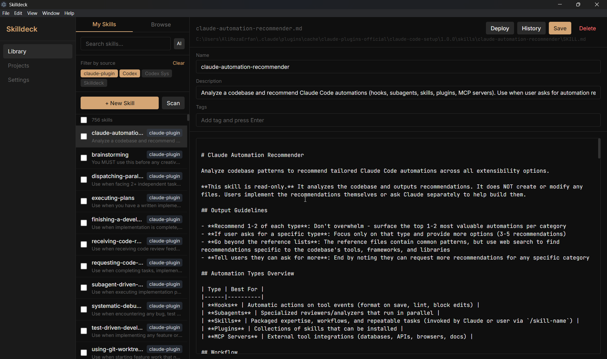

# Skilldeck

**A desktop app for managing AI agent skill files across projects and tools.**  
Works on Windows, macOS, and Linux.

---

---

You spent an hour writing the perfect code review skill. It lives somewhere in `~/projects/old-app/.claude/skills/`. Your new project doesn't have it. Your Cursor setup has a different version. Your Codex project has none at all.

Every AI coding tool wants its own file in its own format in its own location. `CLAUDE.md`. `AGENTS.md`. `.cursor/rules/*.mdc`. `.windsurfrules`. They diverge the moment you copy them. You lose track of which version is canonical. You rebuild from scratch more than you should.

Skilldeck fixes this. One library. Every project. Every tool.

**No cloud. No backend. No database.** Everything lives on your local filesystem.

---

## Features

### Library
- Create, edit, and delete skill files with YAML frontmatter (name, description, tags)
- Full-text search across skill names and descriptions
- Semantic search — describe what you need in plain language, get ranked results
- Filter by tag or source tool
- Bulk selection and batch actions
- Automatic version snapshots on every save, with diff view and one-click rollback

### Discovery
- Scan your machine for existing skills from Claude Code, Codex, Kiro, Amp, Agent Protocol, Gemini, and more
- Source badges show where each skill originated
- Divergence detection when the same skill exists in multiple locations with different content

### Deployment
- Register any project and deploy skills to it
- **10 built-in target profiles** — deploys to the right format and location for each tool automatically:

| Tool | Format | Deploys to |
|------|--------|------------|
| Claude Code | Skill directory | `.claude/skills/` |
| Codex | Skill directory | `.codex/skills/` |
| Kiro | Skill directory | `.kiro/skills/` |
| Amp | Skill directory | `.amp/skills/` |
| Agent Protocol | Skill directory | `.agents/skills/` |
| Cursor | Rules directory | `.cursor/rules/*.mdc` |
| Windsurf | Instructions file | `.windsurfrules` |
| GitHub Copilot | Instructions file | `.github/copilot-instructions.md` |
| Aider | Instructions file | `CONVENTIONS.md` |
| OpenCode | Instructions file | `AGENTS.md` |

- **Deployment state tracking** — know at a glance which deployed skills are current and which are stale
- **Symlink mode** — deploy as symlinks instead of copies for zero-drift sync
- **Instructions-file safety** — preserves existing content when deploying to shared files like `.windsurfrules`
- Undeploy skills from any project with one click

### Sync
- **Bidirectional sync** — edited a skill inside a project? Promote it back to the library and push the improvement everywhere
- **Git sync** — store your library in any Git repo and sync skills across machines without a cloud account

### Community
- Browse and install community skills from [SkillsHub](https://skillshub.dev)
- One-click install with automatic frontmatter generation
- Offline-aware with graceful fallback

---

## Screenshots

*Coming soon — the app is functional, screenshots will be added before v1.0.*

---

## Installation

### Download

Download the latest release from the [Releases](https://github.com/ali-erfan-dev/skilldeck/releases) page. Available for Windows (`.exe`), macOS (`.dmg`), and Linux (`.AppImage`).

### Build from Source

**Prerequisites:** Node.js 18+, npm, Git

```bash
git clone https://github.com/ali-erfan-dev/skilldeck.git
cd skilldeck
npm install
npm run electron:dev
```

This starts the Vite dev server and launches the Electron app in development mode.

### Production Build

```bash
npm run build
```

Compiles TypeScript, builds the Vite frontend, and packages the Electron app.

---

## How It Works

### Data Storage

Everything stays on your local filesystem:

| What | Where |
|------|-------|
| Skill library | `~/.skilldeck/library/` |
| Configuration | `~/.skilldeck/config.json` |
| Deployment records | `~/.skilldeck/deployments.json` |
| Version history | `~/.skilldeck/versions/` |

### Skill File Format

Skills are Markdown files with optional YAML frontmatter:

```markdown
---
name: scope-killer
description: "Prevents scope creep by enforcing task boundaries"
tags: [thinking, scoping]
---

# Scope Killer

When starting a new task:
1. Define the boundary before writing code
2. Flag any work that exceeds the stated scope
3. Suggest splitting oversized tasks
```

Skills without frontmatter fall back to the first `# Heading` for the name and the first paragraph for the description.

### Deployment

When you deploy a skill to a project, Skilldeck:

1. Writes the skill to the correct location and format for the project's target profile
2. Records the deployment with the file hash and timestamp
3. Tracks deployed version vs. library version — shows **stale** if they diverge

### Architecture

```
┌─────────────────────────────────┐
│  React Frontend (Vite + TS)     │
│  State: Zustand                 │
│  Styling: Tailwind CSS          │
├─────────────────────────────────┤
│  Electron Preload (contextBridge)│
├─────────────────────────────────┤
│  Electron Main Process          │
│  IPC handlers per domain        │
│  File I/O via Node.js fs        │
└─────────────────────────────────┘
```

No backend. No cloud services. The renderer communicates with the main process exclusively through Electron's IPC bridge.

---

## Tech Stack

| Layer | Technology |
|-------|-----------|
| Runtime | Electron 28+ |
| Frontend | React 18 + TypeScript |
| Build | Vite |
| State | Zustand |
| Styling | Tailwind CSS |
| File I/O | Node.js fs (via Electron main process) |
| IPC | Electron contextBridge |
| Semantic Search | @xenova/transformers |
| Frontmatter | gray-matter |

---

## Project Structure

```
skilldeck/
├── electron/
│   ├── main.ts              # Electron main process + IPC handlers
│   └── preload.ts           # Context bridge (renderer ↔ main)
├── src/
│   ├── main.tsx             # React entry
│   ├── App.tsx              # Root component + view routing
│   ├── store/               # Zustand stores
│   │   ├── skillStore.ts    # Skills, search, filtering, CRUD
│   │   ├── configStore.ts   # App configuration
│   │   ├── deploymentStore.ts
│   │   └── syncStore.ts     # Cross-tool sync
│   ├── hooks/
│   │   └── useRegistry.ts   # Community registry state
│   ├── components/
│   │   ├── Sidebar.tsx
│   │   ├── SkillEditor.tsx
│   │   ├── SourceBadge.tsx
│   │   ├── RegistryCard.tsx
│   │   └── ConflictModal.tsx
│   ├── views/
│   │   ├── LibraryView.tsx
│   │   ├── ProjectsView.tsx
│   │   └── SettingsView.tsx
│   └── types/
│       └── index.ts
├── package.json
├── vite.config.ts
├── tailwind.config.js
└── tsconfig.json
```

---

## Development

```bash
npm install
npm run electron:dev   # Start Vite + Electron
npm run build          # TypeScript → Vite → Electron package
```

### Design

Refined dark utility — inspired by Linear, Raycast, and Zed. Dark background, precise typography, tight spacing, warm amber accent. Information density over whitespace.

---

## Roadmap

- [ ] Skill Playground — test a skill against Claude Code or Codex without leaving the app
- [ ] A/B testing — run two skill versions against the same prompt, pick the winner
- [ ] Behavioral diff — see exactly what changed between deployed and library versions

---

## Built With a Harness

Skilldeck was built entirely by AI agents (Claude Code) using a harness engineering methodology — a structured system of ground truth files, verification tests, regression gates, and feature intake protocols that kept the agents reliable across weeks of autonomous sessions.

The harness is documented in two articles:
- [Instructions Are Not a Harness](https://medium.com/@ali-erfan/instructions-are-not-a-harness-harness-engineering-in-action-cf6a1b5a3757) — the story: three failure modes, the regression problem, what actually broke
- [The Six-Component Harness](https://medium.com/@ali-erfan/the-six-component-harness-a-template-for-building-reliably-with-ai-agents-b1e8dd6fc640) — the framework: a reusable template for building with AI agents

The harness files (`feature_list.json`, `system-contract.json`, `init.sh`, `verify.spec.ts`, `check-invariants.js`) are included in the repository.

---

## License

MIT